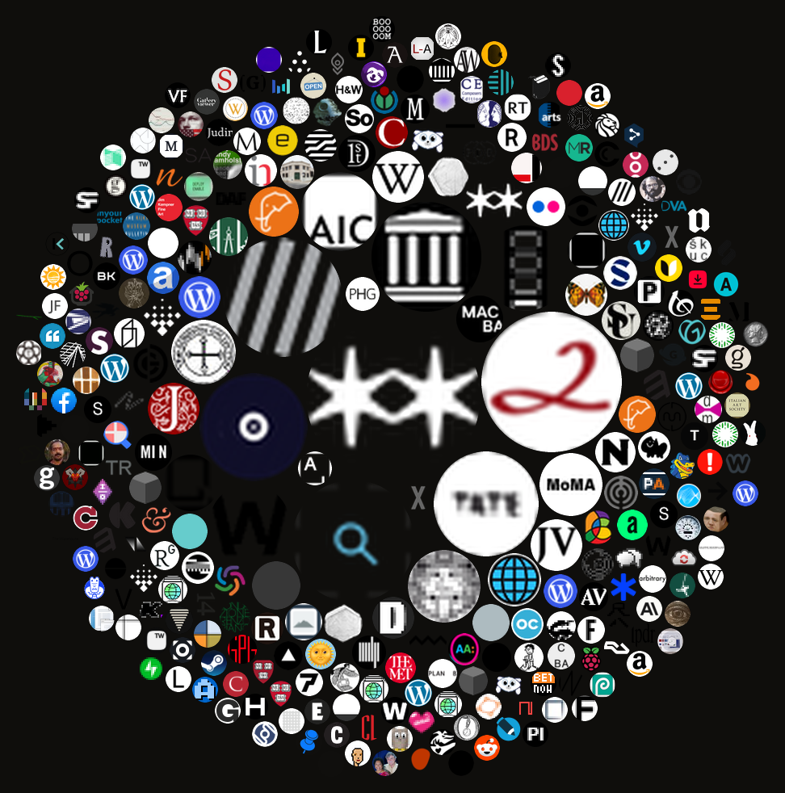
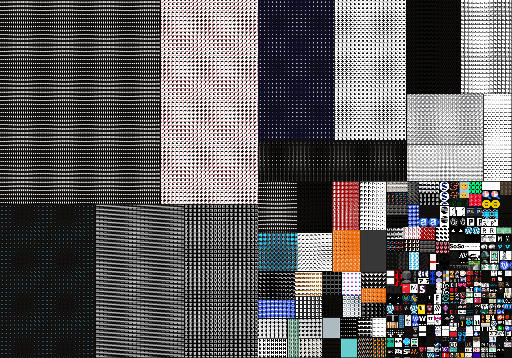

# Favicon Collage 🎨

**Turn your browser history into a collage made from the favicons of every site you've visited.**

Every tile is a real favicon. Lay them out in order and you get a woven timeline of where your attention went; sort them by colour and they become a gradient; pack them by how often you visited and your obsessions bloom into the biggest shapes.

> 🔒 **Everything stays on your machine.** Your history is read inside your own browser and drawn to a canvas locally. Nothing is uploaded, sent, or stored anywhere. There is no server.

<p align="center">
  
  
  
</p>

> 🛈 **A one click Chrome Web Store version is on the way.** It's being prepared for the store, and approval takes a while. Until it's live you can add the exact same extension yourself in about a minute — just follow the steps below.

---

## Add it to your browser (about a minute, no coding)

You're just pointing your browser at a folder. Works in **Chrome, Brave, Edge, Arc, Vivaldi, Opera** — anything built on Chrome.

1. **Get the files.** Near the top of this page click the green **Code** button → **Download ZIP**, then unzip it. You'll get a folder named `favicon-collage`.
2. **Open the extensions page.** In your browser's address bar, type one of these and press Enter:
   - Chrome → `chrome://extensions`
   - Brave → `brave://extensions`
   - Edge → `edge://extensions`
3. **Turn on Developer mode.** It's a switch in the top right corner. Flip it on.
4. **Load it.** Click **Load unpacked**, then choose the **`extension`** folder *inside* the `favicon-collage` folder you unzipped. (Select the `extension` folder itself — don't go inside it.)
5. **Open it.** A small mosaic icon appears in your toolbar (click the 🧩 puzzle piece to pin it if you don't see it). Click the icon and the studio opens in a new tab.
6. **Make a collage.** Press **Generate**. The first time, your browser will ask to let it read your history — click **Allow**. (That reading happens on the page and is never sent anywhere.)

**Updating later:** re-download the ZIP, then on the extensions page click **↻ Reload** on the Favicon Collage card.

### What the controls do
- **Period** — last 7 / 30 / 90 days, 6 months, a year, or all history.
- **Form** — 14 layouts (see below). Switching is instant.
- **Favicons / Colour** — a toggle above the artwork. *Favicons* draws the real icons (the whole point — a small tribute to favicons as overlooked design); *Colour* flattens each to its dominant colour for an abstract field.
- **Index** (left side) — every site in your history as a checklist with its favicon and visit count. **Uncheck anything you'd rather not show** (your bank, socials, whatever) and it updates instantly. Your choices are remembered. Bulk buttons: *All / None / Invert*, plus a search box. There's no built in blocklist — you decide what counts.
- **Zoom & pan** — the artwork fits the frame automatically; scroll to zoom, drag to move around, or hit **Fit**.
- **Save PNG** — exports at full resolution (much larger than what's on screen).
- **Demo** — preview the layouts with placeholder tiles before you grant any permission. (These are *not* real favicons — Generate uses your actual history.)

## Prefer a script?

For people who'd rather run a script, `scripts/sqlite_mosaic.py` reads the browser's local SQLite files directly:

```bash
pip install pillow
python3 scripts/sqlite_mosaic.py --browser brave --mode spiral --days 90
python3 scripts/sqlite_mosaic.py --browser chrome --days 30
```

(Close the browser first, or it may lock the database — the script copies it to a temp file to be safe.) It ships with `chrono`, `spiral`, and `bubbles`; the extension has all 14.

---

## The layouts

| Mode | What it shows |
|---|---|
| **Chronological grid** | Every tab in visit order — the continuous timeline |
| **Grouped by site** | Identical favicons clustered — the mass of each rabbit hole |
| **Unique sites** | One tile per site, sized by how often you visited |
| **Spiral** | Phyllotaxis (sunflower) disc, chronological from the centre out |
| **Rainbow spiral** | …same, but ordered by colour |
| **Colour spectrum** | Every favicon sorted by hue into a woven gradient |
| **Light → dark** | Sorted by brightness — a tonal ramp |
| **Bubble pack** | Circle-packed sites, each bubble sized by visit count |
| **Treemap** | Proportional rectangles per site, tiled with its icon |
| **Hilbert curve** | Favicons threaded on a space-filling curve — rabbit holes become *territories* |
| **Year calendar** | GitHub-style grid, each day = its dominant site |
| **One icon per day** | The year compressed to one signature favicon per day |
| **One row per day** | Each row a day, ragged edge = how deep you went |
| **Time of day clock** | Polar by hour, showing *when* you browse |

---

## How it works

The whole trick is that your browser already stores two things locally: a list of **history** entries and a cache of the **favicon** bitmap for each site. Join them, drop each favicon into a grid (or spiral, or treemap…), and you have a collage.

**In the extension** (no file access needed):
- [`chrome.history.search`](https://developer.chrome.com/docs/extensions/reference/api/history) returns the URLs, visit counts and last-visit times for your chosen timeframe.
- The MV3 [`_favicon` API](https://developer.chrome.com/docs/extensions/how-to/ui/favicons) (`"favicon"` permission) serves the cached icon for any page URL via `chrome-extension://<id>/_favicon/?pageUrl=…&size=32`. We load each as an `Image` and `drawImage` it onto a `<canvas>`.
- Colour-sorted modes read each icon's average colour with a 1×1 offscreen canvas (`getImageData`). These favicons are same-origin to the extension page, so the canvas isn't tainted.
- `canvas.toBlob()` → download. Done — no network at any point.

**In the Python script** the same data lives in SQLite inside the browser profile:
- `History` → table `urls` (`url`, `last_visit_time`, `visit_count`). Chromium stores time as microseconds since 1601-01-01.
- `Favicons` → `icon_mapping` (page-url → icon id) joined to `favicon_bitmaps` (PNG blobs). We decode the blobs with Pillow and composite.

The rendering math (grid, phyllotaxis, squarified treemap, Hilbert `d2xy`, circle-packing) lives in `extension/renderers.js` and is written as a pure module so it can be unit-tested with colour-only tiles — see `tools/render-test.html`.

---

## Privacy & permissions

- **`history`** — to list the sites to render. Read-only, never transmitted.
- **`favicon`** — to fetch the cached icon images.
- No host permissions, no network requests, no analytics, no remote code. You can read every line; it's ~4 small files.

## Curating what shows

There is no built in blocklist. After you Generate, the **Index** on the left lists every site in your history; uncheck the ones you don't want and the collage updates instantly. Your selections are saved, so you only prune once. (A broad "non art" filter is impossible to get right for everyone, so the tool leaves the choice to you.)

## Repo layout

```
extension/      the browser extension (load this unpacked)
  manifest.json, background.js, studio.html/.css/.js
  renderers.js  ← all 14 layout algorithms (pure, testable)
scripts/        sqlite_mosaic.py, the original SQLite method
tools/          render-test.html, headless render harness
docs/           sample images
```

## License

MIT — see [LICENSE](LICENSE). Make weird things with your browsing history.
