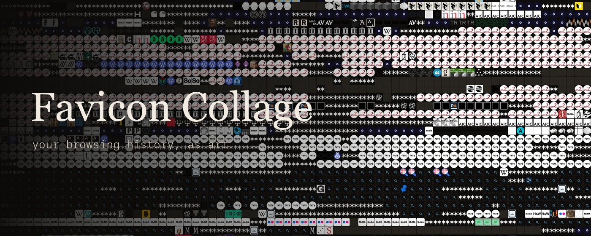
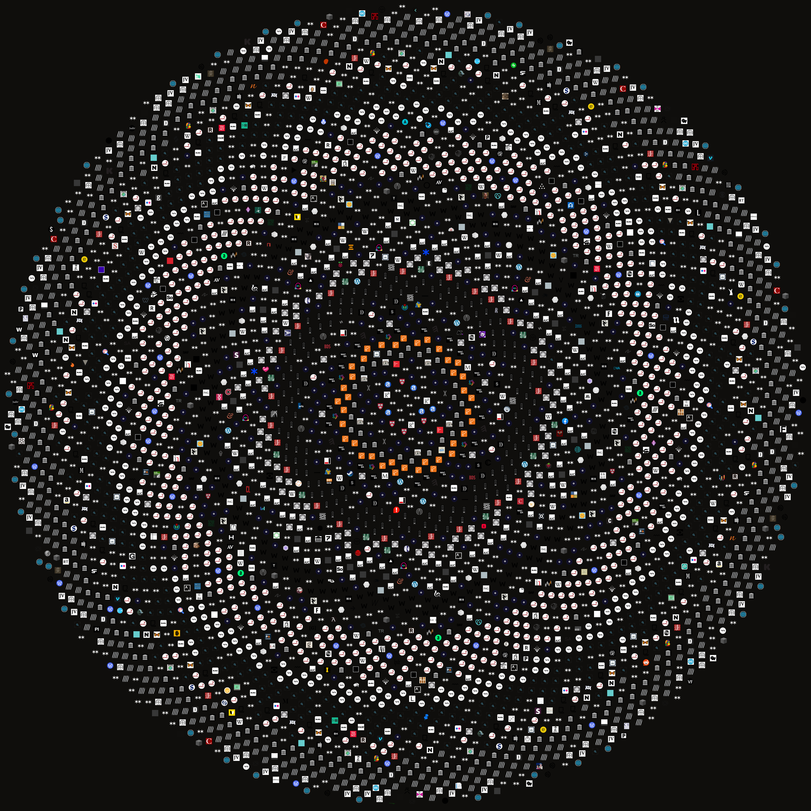

<p align="center"></p>

# Favicon Collage

**Turn your browser history into a collage made from the favicons of every site you have visited.**

Every tile is a real favicon. Lay them out in order and you get a woven timeline of where your attention went. Sort them by colour and they become a gradient. Pack them by how often you visited and your obsessions bloom into the biggest shapes.

<p align="center">
  
  
</p>

> **Everything stays on your machine.** Your history is read inside your own browser and drawn to a canvas locally. Nothing is uploaded or stored anywhere. There is no server.

> **A Chrome Web Store version is on the way.** Store approval takes time, so until it is live you can add the exact same extension yourself in about a minute with the steps below.

---

## Add it to your browser

No code needed. You are just pointing your browser at a folder. Works in Chrome, Brave, Edge, Arc, Vivaldi, and Opera.

1. **Get the files.** Click the green **Code** button near the top of this page, choose **Download ZIP**, and unzip it.
2. **Open the extensions page.** Type one of these in your address bar and press Enter:
   - Chrome: `chrome://extensions`
   - Brave: `brave://extensions`
   - Edge: `edge://extensions`
3. **Turn on Developer mode** using the switch in the top right corner.
4. **Load it.** Click **Load unpacked** and choose the `extension` folder inside the folder you just unzipped. Pick the `extension` folder itself; do not open it.
5. **Open it.** A small mosaic icon appears in your toolbar. If you do not see it, click the puzzle piece icon and pin it. Click the icon and the studio opens in a new tab.
6. **Make a collage.** Press **Generate**. The first time, your browser asks to let it read your history. Click **Allow**. That reading happens on the page and is never sent anywhere.

To update later, download the ZIP again and click **Reload** on the Favicon Collage card on the extensions page.

## How it works

Your browser already keeps two things on disk: your **history** and a cache of each site's **favicon**. The extension joins them and draws each favicon onto a canvas.

- [`chrome.history.search`](https://developer.chrome.com/docs/extensions/reference/api/history) returns the urls, visit counts, and last visit times for the period you pick.
- The MV3 [`_favicon` API](https://developer.chrome.com/docs/extensions/how-to/ui/favicons) serves the cached icon for any page, which the studio loads and draws.
- Colour modes read each icon's average colour from a 1×1 canvas. The icons are same origin to the page, so the canvas stays readable and **Save PNG** works.
- Nothing leaves the page at any point.

The layout math lives in `extension/renderers.js` as a pure module, so it can be tested on its own (see `tools/render-test.html`).

## Permissions

- `history` lists the sites to render. It is only read, never sent.
- `favicon` loads the cached icons.
- `storage` remembers which sites you unchecked.

No host permissions, no network requests, no analytics, no remote code.

## Prefer a script?

`scripts/sqlite_mosaic.py` reads the browser's local files directly and writes a PNG. Close the browser first so the database is not locked; the script copies it to a temp file to be safe.

```bash
pip install pillow
python3 scripts/sqlite_mosaic.py --browser brave --mode spiral --days 90
```

It includes `chrono`, `spiral`, and `bubbles`. The extension has all 14.

## License

MIT. See [LICENSE](LICENSE).
